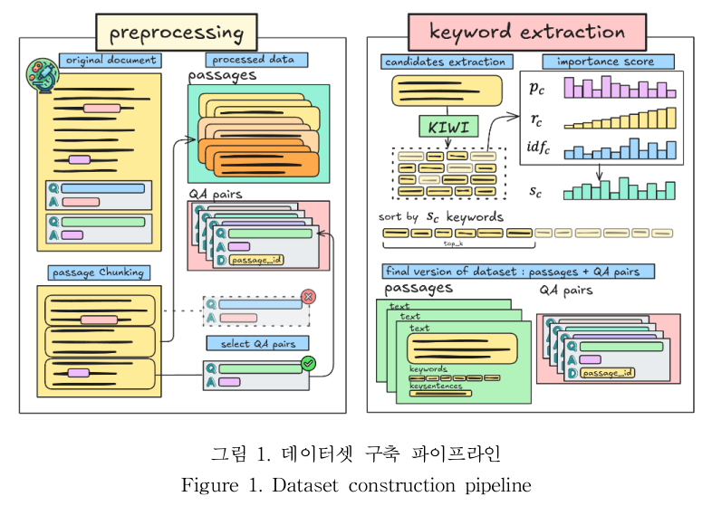

# K-RAG: Korean paper-based Retrieval-Augmented Generation Dataset

K-RAG는 **전문 도메인**에 특화된 **한국어 RAG(Retrieval-Augmented Generation)** 데이터셋으로,  
질문에 대한 응답 생성을 위해 핵심 문서 정보(`keyphrase`, `key sentence`)를 활용합니다.

---


## 데이터 구성

각 샘플은 다음 정보를 포함합니다:

- `id`: 각 샘플의 고유 식별자
- `question`: 사용자 질문
- `answer`(Optional): 모델이 생성해야 할 응답
- `keyphrases`: 문서에서 추출된 핵심 구문 목록
- `key_sentences`: 문서 내 주요 문장
- `gold_passage_id`(Optional): 정답 본문 ID

---


## 데이터셋 통계

| Split  | Samples |
|--------|---------|
| Train  | 54,224  |
| Valid  | 6,778   |
| Test   | 6,779   |

총 **67,781개**의 전문 QA 샘플이 포함되어 있으며,  
분야별 도메인 전문성과 정보 압축성을 갖춘 RAG 학습에 적합합니다.

## 데이터셋 예시

```json
{
  "id": 25537,
  "question": "내수침수로 인한 인명피해와 주요 도심지역의 침수를 예방하기 위해 어떤 대책이 필요한가?",
  "answer": "내수침수로 인한 인명피해와 도심지역 침수를 예방하기 위해서는 기후변화 영향을 평가하고, 구조적 및 비구조적 대책을 마련해야 합니다. 신뢰성 있는 정량적 평가를 통해 정책에 반영하고, 내배수 시스템 개선 및 강우량 예측 기술을 강화하는 것이 중요합니다.",
  "keyphrases": [
    "Kim et al.",
    "강우-유출 관계 분석 방법",
    "주요 도심지역",
    "Koo and Seo",
    "기후변화 연구",
    "향후 기후변화",
    "자연 생태계",
    "설계홍수량 산정",
    "광화문",
    "입력 자료"
  ],
  "key_sentences": {
    "sentences": [
      "강우-유출 관계 분석 방법에서 입력 자료로써 활용되는 확률강우량은 설계홍수량 산정에 가장 중요한 요소이기 때문에 확률강우량의 추정, 변화 그리고 평가 등에 관한 다양한 연구가 진행되고 있다(Kim et al.",
      "최근 기후변화로 인한 극치강우사상은 과거의 강우사상과는 다른 양상으로 광화문(2010), 강남역(2010), 청계천(2010), 청주(2017), 부산(2017)에서 내수침수로 인한 인명피해와 주요 도심지역의 침수로 막대한 재산피해가 발생하였다.",
      ", 2000; Kim and Lee, 2015; Koo and Seo, 2017; Lee and Heo, 2001; Lee et al.",
      "이미 기후변화 연구의 선진국인 미국, 영국, 일본 등에서는 기후변화가 수자원에 미치는 영향을 평가하고, 수자원 설계나 관리에 활용하기 위한 시도가 끊임없이 이뤄지고 있다."
    ],
    "top-3": [0, 1],
    "top-4": [0, 1, 2],
    "top-5": [0, 1, 2, 3]
  },
  "gold_passage_id": "JAKO201816563163768-1"
}
```
---

